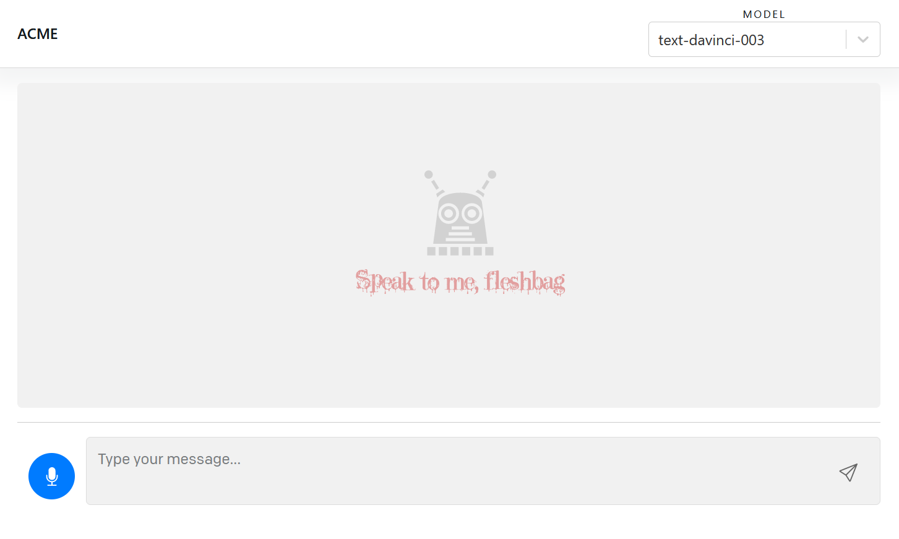

# OpenAI API NextJS Demo

Just a simple fork of the NextJS demo for messing around with the OpenAI API. Adds a basic chat interface for freeform interaction with a text model. Also implements the Whisper API to record and transcribe user audio messages, as well as the Google Cloud text-to-speech API to narrate bot responses.

Your own personal conversation bot! Talk to him, laugh with him, cry with him. He is here to help you, not to destroy the essential fabric of modern society.



## Setup

1. If you don’t have Node.js installed, [install it from here](https://nodejs.org/en/) (Node.js version >= 14.6.0 required)

2. Clone this repository

3. Navigate into the project directory

   ```bash
   $ cd openai-quickstart-node
   ```

4. Install the requirements

   ```bash
   $ npm install
   ```

5. Make a copy of the example environment variables file

   On Linux systems:

   ```bash
   $ cp .env.example .env
   ```

   On Windows:

   ```powershell
   $ copy .env.example .env
   ```

6. Add your [API key](https://platform.openai.com/account/api-keys) to the newly created `.env` file

7. You'll need to create a Google Cloud Platform account if you don't have one, and follow the steps to create a service account key for the Text To Speech API. Place the JSON key file in the root folder and set the path in the `.env` file.

8. Run the app

   ```bash
   $ npm run dev
   ```

You should now be able to access the app at [http://localhost:3000](http://localhost:3000)!
